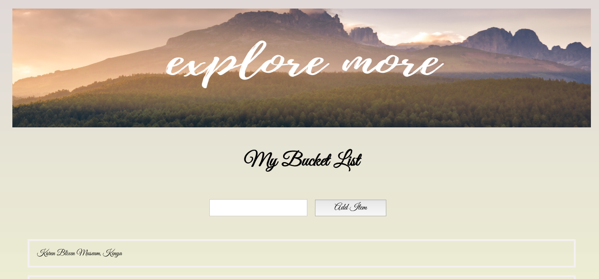
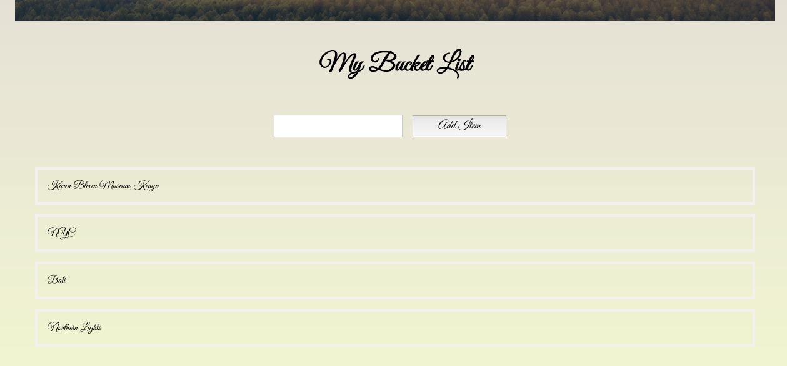

## Bucket List

This project was bootstrapped with [Create React App](https://github.com/facebook/create-react-app).

**Bucket List** is a simple React application, that allows user to add items to their bucket list.

## How to run

* Clone the project - git clone https://github.com/emilyjspencer/Bucket-List.git
* Cd into the repo 
* Type the command:
```html
npm start
```
* Go to the following address in the browser: localhost:3000


## Built with

* React
* CSS


## What it looks like 





